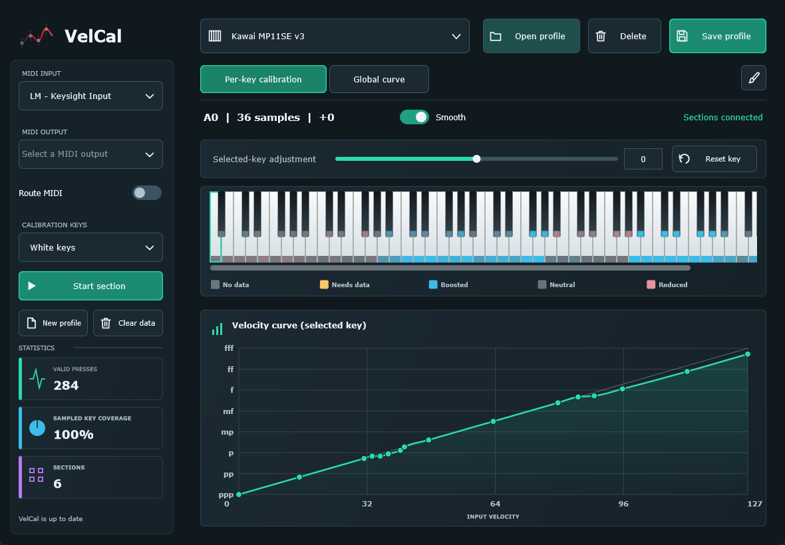
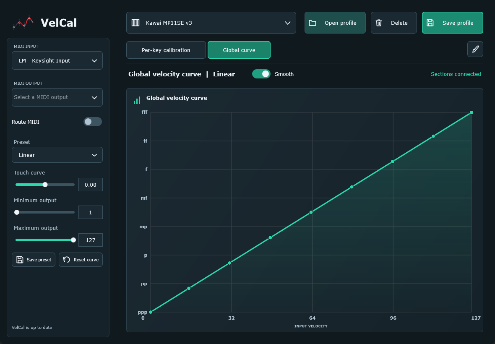

# VelCal

VelCal is a free, open-source app for making the velocity response of a MIDI
keyboard more consistent from key to key. If some keys play noticeably louder
or quieter than others under a similar touch, VelCal can measure those
differences and adjust the MIDI sent to your DAW or software instrument.

It sits between your keyboard and your instrument. It changes MIDI velocity,
not audio, and does not change your keyboard's built-in sounds or repair its
physical action.

**[Download VelCal](https://github.com/SH4DOWSIX/VelCal/releases/latest)**

Installers include standalone and VST3 on Windows, Linux, and
macOS, plus an AU MIDI effect for Logic on macOS. Only Windows has real keyboard
and DAW validation; Linux/macOS are experimental. See
[installation and DAW routing](docs/INSTALLING.md) and
[0.0.3 release notes](docs/releases/0.0.3.md), including unsigned-installer warnings
and build-verification status.

## What You Can Do

- Calibrate individual keys automatically by pressing groups of keys together.
- Work across the keyboard in short, overlapping sections, with separate passes
  for white and black keys.
- Fine-tune a selected key's response with an adjustment slider or editable curve.
- Change the feel of the whole keyboard with a global curve and presets such as
  Soft touch, Firm touch, Compressed, and Wide dynamics.
- Switch smoothing on or off for all keys together, with a separate Smooth
  setting for the global curve.
- Save profiles and load them again for future playing sessions.
- Send corrected MIDI to your DAW while preserving pedals, pitch bend, and other
  MIDI messages.
- Choose from 16 remembered accent colours, shared by standalone and plugins.

## Screenshots

**Per-key calibration**: keyboard coverage, section statistics, and the selected
key's velocity curve.



**Global curve**: shape the whole keyboard's response with presets, touch curve,
and output limits.



## Get Started

1. Run the installer for your operating system and choose standalone and/or
   plugins. Open standalone from your applications menu, or load the plugin
   in your DAW following the [routing guide](docs/INSTALLING.md#daw-routing).
2. Connect your keyboard. In standalone select it under **MIDI input**; in a
   plugin select the input in your DAW instead.
3. Select **New profile** to start a calibration, or **Open profile** to load one
   you have already saved.

You do not need to set up a MIDI output just to calibrate. Set up routing when
you are ready to play through your DAW.

## Calibrate Your Keyboard

Use a rigid object with a straight, smooth edge, such as a straight piece of
wood or a spirit level. It only needs to cover a short group of keys, not the
whole keyboard. Make sure it is clean and smooth so it will not scratch the
keys, and do not use excessive force.

**Push down near the middle of the object to distribute pressure as evenly as
possible across the keys.** Pushing harder on one side can produce a bad
calibration: VelCal may mistake the uneven pressure for a difference between
the keys themselves.

1. In **Per-key calibration**, choose **White keys** under **Calibration keys**.
   Place the straight edge across a group of white keys.
2. Select **Start section**, read the guide, then select **Begin capture**.
3. Press the same group together repeatedly, fully releasing the keys each
   time. Make a mixture of soft, medium, and firm presses. The first few presses
   let VelCal identify which keys are under the bar.
4. Follow the live guidance until the section is ready. Each covered key needs
   at least eight accepted soft, eight medium, and eight firm measurements.
   Incomplete or inconsistent presses may not count, so this can take more
   than 24 presses.
5. Select **Finish section**. Move the bar along the keyboard, overlapping the
   previous section by at least two white keys (three or four is better), and
   repeat for the range you want to calibrate.
6. Choose **Black keys** and repeat the process for the black keys, overlapping
   each new black-key section with the previous one.
7. Select **Save profile** when you are finished.

Keep sections overlapping within each key colour. Without shared keys, VelCal
cannot reliably compare the response of neighbouring sections. You can calibrate
just the range you use; uncalibrated keys have no automatic per-key correction.

The keyboard display helps you check progress: amber means a key still needs
data; cyan means it is being boosted; red means it is being reduced; grey means
it is already close to neutral. A key without a status strip has no measurements.

## Play Through Your DAW

With VST3, load VelCal as an instrument on its own track, then select that
instance as the piano track's MIDI input. It is not an audio insert. With Logic,
load the AU version in the piano track's MIDI FX slot, before the instrument.
Plugins include calibration and all editing features; the DAW selects devices.

For standalone, the MIDI path should be:

```text
Keyboard -> VelCal -> MIDI port -> DAW or software instrument
```

### Windows

VelCal does not create its own virtual MIDI cable on Windows. Use
[loopMIDI](https://www.tobias-erichsen.de/software/loopmidi.html), or another
installed virtual MIDI cable. This is a MIDI connection, not a virtual audio cable.

1. Install and open loopMIDI. Use its **+** button to create a port named
   `VelCal Output`, and keep loopMIDI running.
2. Start or restart VelCal so the port appears. Select your keyboard as
   **MIDI input** and `VelCal Output` as **MIDI output**.
3. In your DAW, select that same port as the instrument track's MIDI input.
   Load a software instrument and enable the track's monitoring as needed.
4. Load your saved profile in VelCal and enable **Route MIDI**.

Have the instrument track listen to the virtual port rather than also receiving
the physical keyboard directly, otherwise you may hear duplicate notes or
uncorrected notes. Do not send the DAW's MIDI output back into VelCal's input.

### macOS And Linux

Select **VelCal Output (virtual)** as VelCal's MIDI output, then select the
`VelCal Output` port in your DAW and enable **Route MIDI**. You can also select
an existing MIDI output instead. Native virtual ports are implemented, but
hardware and DAW behaviour on these platforms has not yet been verified.

## Adjust The Feel

In **Per-key calibration**, select a key on the displayed keyboard to adjust
it individually. Drag points on its curve, click to add a point, or right-click
an interior point to remove it. **Reset key** returns it to automatic calibration.

**Smooth** on this tab applies to all keys together, not just the selected key,
and defaults to on for new profiles. Automatic smoothing softens quantization
kinks while staying within one velocity step of the calibrated map. Switch it
off to use the original generated map. Toggling Smooth preserves measurements,
manual control points and adjustments; **Reset key** preserves the Smooth choice.

In **Global curve**, choose a preset or edit the curve to change the response
of the whole keyboard after the individual key corrections. Its independent
**Smooth** setting switches between smooth interpolation and straight lines
between points. You can save custom global presets inside your profile.

## Profiles And Appearance

Use **Save profile** after calibration or editing. Changes are not saved
automatically; standalone warns before closing or replacing an edited profile.
The profile selector displays saved filenames without `.velcal.json`, rather
than internal profile or MIDI-device names. It also identifies unsaved profiles
and an empty library.

Installed builds keep profiles/preferences in writable per-user storage and
preserve them on uninstall. See [profile locations](docs/INSTALLING.md#profiles-and-updates).
Back up important profiles. Plugin project state includes completed profiles
and edits, even if the original profile file is later missing, but not unfinished
calibration captures.

Select the paintbrush beneath **Save profile** to choose an accent colour.
The choice takes effect immediately, is remembered across restarts, and is shared
by standalone and plugin editors. It does not alter your calibration profiles.

The bottom-left status in installed builds checks for a newer GitHub release.
It reports available updates but does not download or install them automatically;
use the [release downloads](https://github.com/SH4DOWSIX/VelCal/releases/latest)
to update. Your saved profiles/preferences are retained during an upgrade.

## Notes And Help

- The display always shows 88 keys, even for smaller keyboards; MIDI processing
  supports all 128 MIDI notes.
- Different octave naming conventions are not a problem: VelCal uses MIDI note
  numbers. Keep your keyboard's transpose/octave-shift settings unchanged
  between calibration and playing.
- This is an early release. There is no undo/redo or individual section removal
  yet. If routing stops or behaves unexpectedly, bypass the plugin or disable
  standalone's **Route MIDI**, and
  check your MIDI connections for a feedback loop.
- Found a problem, especially on Linux or macOS?
  [Open an issue](https://github.com/SH4DOWSIX/VelCal/issues/new) with your OS,
  keyboard, DAW, and steps to reproduce it.

## Development

Want to build or contribute? See the [build guide](docs/BUILDING.md) and
[architecture overview](docs/architecture.md). The detailed project handoff
is in [docs/PLAN.md](docs/PLAN.md).

## Licence

AGPL-3.0-only. See [LICENSE](LICENSE).
